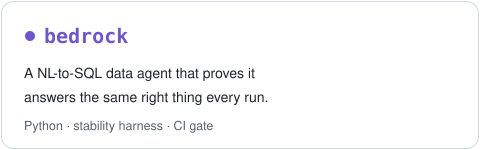
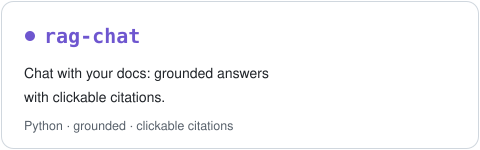
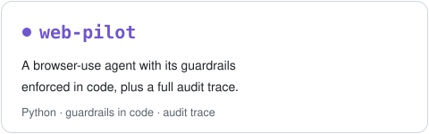
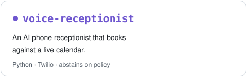
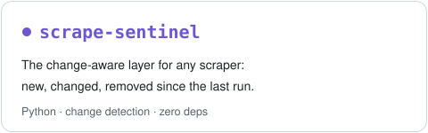
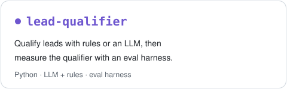
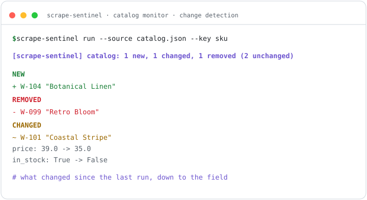

> **The model proposes, the code disposes.** 
> The model holds the conversation. Tested code makes every decision that matters.

I build retrieval, agents, MCP servers, voice, and automation with that one rule at the center. The flagships ship deterministic test suites that need no API key, show captured output from actual runs, and come with an architecture diagram; every README is honest about the trade-offs. Twenty-nine public projects, more than 500 deterministic tests, one rule.

> My client work is under NDA and stays private. These public projects are built to the same standard, and show how I work: grounded, tested, and honest.

<a href="#the-house-rule-running">The rule, running</a> &middot; <a href="#the-free-handbook">Free handbook</a> &middot; <a href="#flagships">Flagships</a> &middot; <a href="#retrieval-and-rag">Retrieval and RAG</a> &middot; <a href="#agents-and-tools">Agents and tools</a> &middot; <a href="#voice-and-automation">Voice and automation</a> &middot; <a href="#evaluation-and-quality">Evaluation and quality</a> &middot; <a href="#data-engineering-and-extraction">Data engineering and extraction</a> &middot; <a href="#stack">Stack</a> &middot; <a href="#how-i-work">How I work</a>

## The house rule, running

<picture>
  <source media="(prefers-color-scheme: dark)" srcset="assets/safety-demo-dark.svg">
  
</picture>

Three scenes on rotation, all from captured runs: <a href="https://github.com/vinimabreu/web-pilot">web-pilot</a>'s guardrails blocking a credential field and an off-site jump (<code>examples/safety_demo.py</code>), <a href="https://github.com/vinimabreu/rag-chat">rag-chat</a> abstaining below its measured BM25 floor, and <a href="https://github.com/vinimabreu/doc-eval">doc-eval</a>'s gate failing a candidate that improved the headline number while losing a field. Each one is reproducible from its repo.

## The free handbook

<table><tr><td width="170" valign="top">

</td><td valign="top">

**[Artificial Intelligence in Practice](https://github.com/vinimabreu/ai-in-practice)**: a free 84-page handbook that walks from "what is a token" to working agents with tools. Local models, RAG, agents, MCP, fine-tuning, real API costs, security, prompting as a method, and how to test AI systems so they do not embarrass you in front of a customer. Written for people starting out in AI, with every example tested by hand. CC BY-NC-SA: share it, translate it, teach with it.

<a href="https://github.com/vinimabreu/ai-in-practice/blob/main/Artificial_Intelligence_in_Practice.pdf">Read the PDF</a> &middot; <a href="https://github.com/vinimabreu/ai-in-practice">Star the repo</a> &middot; <a href="https://dev.to/vinimabreu">Chapters serialized on dev.to</a>

</td></tr></table>

## Flagships

  <a href="https://github.com/vinimabreu/bedrock"><picture><source media="(prefers-color-scheme: dark)" srcset="assets/flagship-bedrock-dark.svg"></picture></a>
  <a href="https://github.com/vinimabreu/rag-chat"><picture><source media="(prefers-color-scheme: dark)" srcset="assets/flagship-rag-chat-dark.svg"></picture></a>
  <a href="https://github.com/vinimabreu/web-pilot"><picture><source media="(prefers-color-scheme: dark)" srcset="assets/flagship-web-pilot-dark.svg"></picture></a>
  <a href="https://github.com/vinimabreu/voice-receptionist"><picture><source media="(prefers-color-scheme: dark)" srcset="assets/flagship-voice-receptionist-dark.svg"></picture></a>
  <a href="https://github.com/vinimabreu/scrape-sentinel"><picture><source media="(prefers-color-scheme: dark)" srcset="assets/flagship-scrape-sentinel-dark.svg"></picture></a>
  <a href="https://github.com/vinimabreu/lead-qualifier"><picture><source media="(prefers-color-scheme: dark)" srcset="assets/flagship-lead-qualifier-dark.svg"></picture></a>

<a href="https://github.com/vinimabreu/bedrock">bedrock</a> &middot; <a href="https://github.com/vinimabreu/rag-chat">rag-chat</a> &middot; <a href="https://github.com/vinimabreu/web-pilot">web-pilot</a> &middot; <a href="https://github.com/vinimabreu/voice-receptionist">voice-receptionist</a> &middot; <a href="https://github.com/vinimabreu/scrape-sentinel">scrape-sentinel</a> &middot; <a href="https://github.com/vinimabreu/lead-qualifier">lead-qualifier</a>

## Retrieval and RAG

*Citations you can click, an honest "I don't know", and retrieval quality that is measured, not assumed.*

**[source-of-truth](https://github.com/vinimabreu/source-of-truth)** 
Centralizes scattered sources (markdown, FAQ, HTML, plaintext) into one queryable base that flags where two sources disagree, marks stale sources, and abstains honestly. Deterministic, no API key.

**[rag-chat](https://github.com/vinimabreu/rag-chat)** 
Chat-with-your-docs widget: grounded answers with clickable citations and a working chat UI. Key-free demo mode.

**[rag-quality](https://github.com/vinimabreu/rag-quality)** 
A RAG pipeline with its own eval harness (hit@k, MRR, recall@k): BM25, dense, and RRF hybrid retrieval, scored against a labeled corpus.

**[mini-rag](https://github.com/vinimabreu/mini-rag)** 
A small, working RAG API on FastAPI, Chroma, and Claude. The clean baseline.

## Agents and tools

*Agents that can only do what their tool layer allows.*

**[web-pilot](https://github.com/vinimabreu/web-pilot)** 
Browser-use agent built on the house rule: the model proposes one action, code disposes. Closed action vocabulary, guardrails (domain allowlist, no credential or payment fields, step budget), full audit trace.

**[lead-quorum](https://github.com/vinimabreu/lead-quorum)** 
Distributed multi-agent lead qualifier on Google ADK and the A2A protocol: two readers on different Gemini models extract every lead independently as separate microservices, deterministic code scores it with a reason that provably sums to the number, and when the readings disagree on which rules fire it abstains instead of guessing.

**[multi-agent-analyst](https://github.com/vinimabreu/multi-agent-analyst)** 
Planner, self-correcting SQL agent, BM25 retriever, and a verifier crew. Cites evidence or honestly refuses.

**[sql-agent](https://github.com/vinimabreu/sql-agent)** 
Plain English to SQL, with a self-correction loop, on a read-only connection.

**[mcp-listings](https://github.com/vinimabreu/mcp-listings)** 
MCP server exposing a property-listings dataset to Claude as typed tools.

## Voice and automation

*Conversation up front, a tested service underneath, and a human whenever confidence drops.*

**[voice-receptionist](https://github.com/vinimabreu/voice-receptionist)** 
AI phone receptionist over Twilio: books against a live calendar, abstains on policy questions, logs every call.

**[retell-sms-handler](https://github.com/vinimabreu/retell-sms-handler)** 
Makes a Retell voice agent's In-Call SMS fire deterministically through a Conversation Flow function node: consent gated, the destination resolved in code, every send logged. FastAPI and Twilio.

**[n8n-lead-triage](https://github.com/vinimabreu/n8n-lead-triage)** 
n8n routes, a tested HTTP service decides. Low confidence or any model failure routes to a human, never to silence.

**[grounded-copy](https://github.com/vinimabreu/grounded-copy)** 
Generates on-brand product copy from your catalog, then checks every claim back against it: an invented price, spec, discount or material is flagged for review, nothing fabricated ships. Deterministic, key-free core.

## Evaluation and quality

*A regression gets blocked before it ships, not discovered after.*

**[bedrock](https://github.com/vinimabreu/bedrock)** 
A natural-language-to-SQL data agent with a stability harness: it runs each question K times against a defended answer key, flags the ones that flap, and a CI gate blocks a candidate when reliability regresses. Deterministic, key-free demo.

**[doc-eval](https://github.com/vinimabreu/doc-eval)** 
Field-level evaluation and a CI release gate for LLM document extraction.

**[lead-qualifier](https://github.com/vinimabreu/lead-qualifier)** 
Qualifies scraped leads with rules or an injected LLM (a 0-100 score, a reason, keep or drop), then measures the qualifier itself: precision, recall, and f1 against a labeled set. Zero runtime dependencies.

**[token-ledger](https://github.com/vinimabreu/token-ledger)** 
The LLM bill is total input and output tokens across every call a query makes, not chunk math. Records what the provider's API reports, per call, and answers with one GROUP BY. Cache buckets kept disjoint so cost never double-charges, unknown models flagged unpriced not zeroed. Zero dependencies, dashboard included.

## Data engineering and extraction

*The layer underneath everything above: scrape, parse, validate, schedule.*

<picture>
  <source media="(prefers-color-scheme: dark)" srcset="assets/indicators-dark.svg">
  
</picture>

Not a screenshot: live numbers from the Central Bank of Brazil, refreshed on weekdays by <a href="https://github.com/vinimabreu/vinimabreu/blob/main/.github/workflows/update-indicators.yml">a scheduled pipeline in this repo</a>, committed only when the data changes. The commit history is the proof.

**[record-refinery](https://github.com/vinimabreu/record-refinery)** 
Raw business records in, a clean deduplicated dataset plus a QA brief out. Email, phone, and url validated in code, with an optional model-proposed canonical name for fuzzy dedup.

**[pdf-extract](https://github.com/vinimabreu/pdf-extract)** 
PDFs into validated structured JSON, with pluggable OCR.

**[docs-to-markdown](https://github.com/vinimabreu/docs-to-markdown)** 
Any documentation or marketing site into a clean Markdown corpus, ready for RAG.

**[ai-watcher](https://github.com/vinimabreu/ai-watcher)** 
Watches RSS feeds and turns new articles into structured AI summaries with Claude.

**[bcb-data-pipeline](https://github.com/vinimabreu/bcb-data-pipeline)** 
Daily ETL of Brazilian macro indicators from the central bank API, on pandas and GitHub Actions.

**[web-scraper](https://github.com/vinimabreu/web-scraper)** 
A Playwright scraper, SQLite storage, and a Streamlit dashboard, end to end.

**[scrape-sentinel](https://github.com/vinimabreu/scrape-sentinel)** 
The change-aware layer for any scraper: turns a list of records into new, changed, and removed since the last run, then alerts and stores a snapshot. Zero runtime dependencies.

**[repo-packager](https://github.com/vinimabreu/repo-packager)** 
Downloads GitHub repos and delivers clean, deterministic ZIPs: strips build noise and credential files, builds a byte-for-byte reproducible archive, and writes a manifest with the sha256 and the rule that removed each file. Standard library only.

**[cloudrun-pipeline](https://github.com/vinimabreu/cloudrun-pipeline)** 
Takes a pipeline from a local script to a deployed service that runs on a schedule, with health checks, run history, and retries. Built for Google Cloud Run.

**[crosswatch](https://github.com/vinimabreu/crosswatch)** 
Cross-source corroboration and scheduled scoring for data you cannot trust from one provider: two sources confirm each other or the row is excluded, every score ships a plain-language reason that provably sums to the number, and a config-driven scheduler runs it all on cadence with a kill switch. Zero runtime dependencies.

<picture>
  <source media="(prefers-color-scheme: dark)" srcset="assets/sentinel-demo-dark.svg">
  
</picture>

Captured output: <a href="https://github.com/vinimabreu/scrape-sentinel">scrape-sentinel</a> diffing two runs of a product catalog. It reports what is new, gone, and changed down to the field, then alerts and stores a snapshot. Reproducible from the repo's offline demo.

## Stack

**Core** &nbsp;Python &middot; FastAPI &middot; Flask &middot; Pydantic &middot; pytest 
**Retrieval** &nbsp;Chroma &middot; BM25 + dense embeddings &middot; SQLite 
**Models** &nbsp;Anthropic Claude API &middot; Google Gemini &middot; MCP (Model Context Protocol) &middot; Google ADK + A2A 
**Extraction** &nbsp;Playwright &middot; pandas &middot; Tesseract OCR &middot; AWS Textract (optional adapter) 
**Automation** &nbsp;n8n &middot; Twilio &middot; Retell &middot; Streamlit 
**Full-stack web** &nbsp;TypeScript &middot; JavaScript &middot; React &middot; Next.js &middot; Vue &middot; Node.js &middot; Vercel &middot; Supabase 
**Ops** &nbsp;Docker &middot; GitHub Actions &middot; Google Cloud Run

## How I work

| Grounded | Tested | Honest |
| --- | --- | --- |
| Answers cite their sources and refuse when the evidence is not there. | Deterministic suites that run with no API key and no network; CI gates catch regressions. | Trade-offs go in the README: rag-quality ships the eval showing hybrid retrieval was not a free win on its corpus. |

> "He built a reusable, profile-driven Python data cleansing framework with strong architecture, clear documentation, automated tests, and disciplined output controls. [...] The final delivery was professional, well-structured, tested, and ready for the next productisation phase. I would confidently work with Vinicius again."
>
> recent client review

> "completed the work ahead of schedule and with accuracy. I would hire him again."
>
> another client review

  <b>Open to AI engineering, RAG, agents, and data work.</b> 
  RAG and LLM systems, agents and automations, scraping and data pipelines, all built with tests and CI. 
  Based in Brazil, working with clients worldwide.

