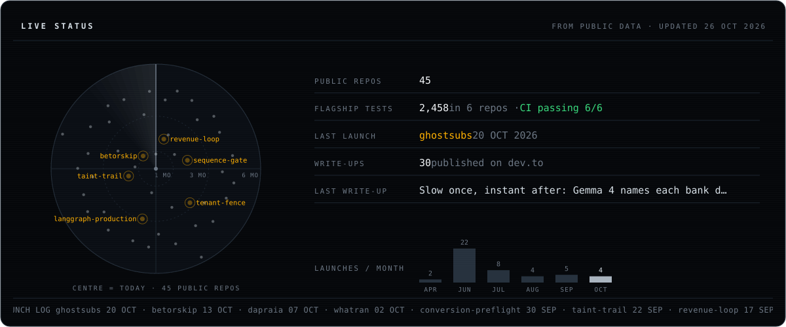
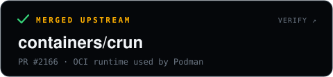
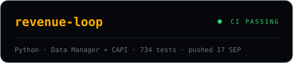
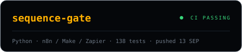
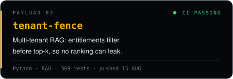
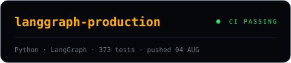
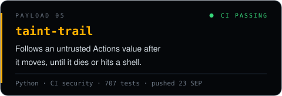
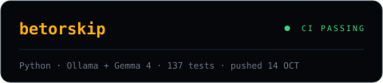
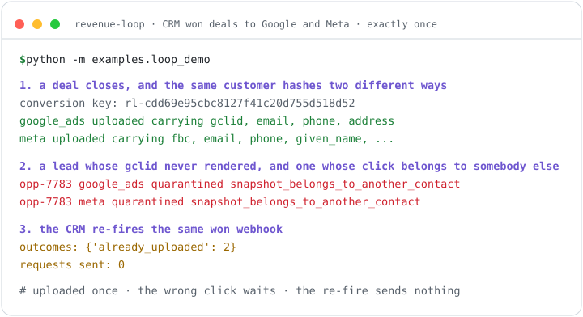

> **The model proposes, the code disposes.** 
> The model holds the conversation. Tested code makes every decision that matters.

I build retrieval, agents, MCP servers, voice, and automation with that one rule at the center. The flagships ship deterministic test suites that need no API key and show captured output from actual runs; every README is honest about the trade-offs. The console below counts the public repos and the tests their READMEs state, fresh every weekday; one rule runs through all of them.

> My client work is under NDA and stays private. These public projects are built to the same standard, and show how I work: grounded, tested, and honest.

  
  
  
  

  
  
  
  
  
  
  
  
  
  
  
  
  

## The house rule, running

<picture>
  <source media="(prefers-color-scheme: dark)" srcset="assets/safety-demo-dark.svg">
  
</picture>

Three scenes on rotation, all from captured runs: <a href="https://github.com/vinimabreu/betorskip">betorskip</a> refusing a $84.00 return that Gemma worked out on its own, because the slip only prints To Win $64.00 (the recorded model answer in <code>examples/readings</code>); <a href="https://github.com/vinimabreu/sequence-gate">sequence-gate</a> stopping a send after the invoice was paid, refusing a replay and holding a message at 00:12 in the contact's time zone (<code>examples/demo.py</code>, column spacing trimmed); and <a href="https://github.com/vinimabreu/web-pilot">web-pilot</a>'s guardrails blocking a credential field and an off-site jump (<code>examples/safety_demo.py</code>). Each one is reproducible from its repo.

## The free handbook

<table><tr><td width="170" valign="top">

</td><td valign="top">

**[Artificial Intelligence in Practice](https://github.com/vinimabreu/ai-in-practice)**: a free 84-page handbook that walks from "what is a token" to working agents with tools. Local models, RAG, agents, MCP, fine-tuning, real API costs, security, prompting as a method, and how to test AI systems so they do not embarrass you in front of a customer. Written for people starting out in AI, with every example tested by hand. CC BY-NC-SA: share it, translate it, teach with it.

<a href="https://github.com/vinimabreu/ai-in-practice/blob/main/Artificial_Intelligence_in_Practice.pdf">Read the PDF</a> &middot; <a href="https://github.com/vinimabreu/ai-in-practice">Star the repo</a> &middot; <a href="https://dev.to/vinimabreu">Chapters serialized on dev.to</a>

</td></tr></table>

## Invited review

**[A Decision-Centered Reference Architecture for Trustworthy Agentic Commerce](https://arxiv.org/abs/2607.18347)** 
Invited technical reviewer on this decision-centered reference architecture by Dimitrios S. Sfyris, founder of AspectSoft, now published on arXiv. Credited by name for refining the separation between commercial eligibility and actor authority, payment artifacts treated as evidence rather than automatic permission, and the controls that keep AI-generated claims grounded, scoped, and verifiable.

## Merged upstream

**[containers/crun#2166](https://github.com/containers/crun/pull/2166)** 
crun is the OCI runtime that Podman and CRI-O run containers with. Its passwd parser tested for a digit with `**s - '0' < 10`, a signed comparison with no lower bound: `**s` promotes to `int`, so every byte below `'0'` yields a negative value that is also below 10. Out of the 256 possible byte values, 186 kept the loop running and `'\0'` was one of them, so a passwd line whose uid field is empty walks the parser past the end of the buffer. The correct form was imported from musl in June 2020 and lost its `U` suffix 43 minutes later, in a commit that dropped it to silence `-Werror=sign-compare` on the Alpine build, which is where the affected path compiles. Traced back to that commit and fixed with an explicit range test that stays warning free without a cast. Reviewed and merged by the project maintainer.

## CI security

*The scanner finds the template. This follows the value after someone moves it.*

**[taint-trail](https://github.com/vinimabreu/taint-trail)** 
The usual fix for `${{ github.event.comment.body }}` inside a `run:` block is to move the value into `env:`, which removes the finding from every scanner that looks for templates in scripts and removes nothing from the job. This follows the value after the move: through `env:`, `with:`, step outputs and into the called action, recursively, until it dies as a discrete argument with no shell in between, reaches a shell, can spoof `$GITHUB_OUTPUT` through a static heredoc delimiter, or becomes opaque, in which case it says exactly where it stopped and why instead of guessing. Every verdict is a chain with a file and line at each hop, because that is what convinces a maintainer. Modelled on a real finding in coordinated disclosure. 707 tests, one dependency, no network, no key.

## Flagships

  
  
  
  
  
  

<a href="https://github.com/vinimabreu/revenue-loop">revenue-loop</a> &middot; <a href="https://github.com/vinimabreu/sequence-gate">sequence-gate</a> &middot; <a href="https://github.com/vinimabreu/tenant-fence">tenant-fence</a> &middot; <a href="https://github.com/vinimabreu/langgraph-production">langgraph-production</a> &middot; <a href="https://github.com/vinimabreu/taint-trail">taint-trail</a> &middot; <a href="https://github.com/vinimabreu/betorskip">betorskip</a>

https://github.com/user-attachments/assets/9c36119b-a972-40bf-8418-8c00f87f98ab

<em>▶ 60-second profile reel</em>

## Retrieval and RAG

*Citations you can click, an honest "I don't know", retrieval quality that is measured rather than assumed, and a fence between customers that a ranking cannot climb over.*

| Repo | What it does |
|---|---|
| **[tenant-fence](https://github.com/vinimabreu/tenant-fence)** | Multi-tenant RAG retrieval where cross-tenant leakage is impossible by construction |
| **[on-behalf](https://github.com/vinimabreu/on-behalf)** | Permission-aware RAG that asks the source, as the user, at query time |
| **[source-of-truth](https://github.com/vinimabreu/source-of-truth)** | One queryable base from scattered sources that flags conflicts, marks stale ones and abstains honestly |
| **[rag-chat](https://github.com/vinimabreu/rag-chat)** | Chat with your docs: grounded answers with clickable citations and an honest "I don't know" |
| **[rag-quality](https://github.com/vinimabreu/rag-quality)** | A RAG pipeline that measures retrieval quality instead of assuming it |
| **[mini-rag](https://github.com/vinimabreu/mini-rag)** | A small, working Retrieval-Augmented Generation API (FastAPI + Chroma + Claude) |

<b>Full notes on these 6</b>

**[tenant-fence](https://github.com/vinimabreu/tenant-fence)** 
One knowledge base, many customers, and an entitlement filter that runs before the candidate set is scored instead of after it. The wrong version ships beside the right one so the suite can demonstrate the leak rather than describe it: same corpus, same question, same account, three sections returned one way and none at all the other. 369 tests, 141 of them adversarial, and every number in the README read off the offline demo.

**[on-behalf](https://github.com/vinimabreu/on-behalf)** 
The other half of the fence: people inside the same organization, where the authority over who opens a document is Microsoft Graph or Google Drive, not the index. Every candidate is checked against the source at query time, as the signed-in user, through a modeled on-behalf-of token exchange, and enters the answer with its right named: a direct grant, a nested group, a sharing link, a site role. The index that copies ACLs at ingestion ships beside it, wrong by design, so the suite can demonstrate the leaks that a revoked grant, a group removal, and an expired sharing link each open. Fails closed, raises instead of silently filtering, 353 tests, no network, no key.

**[source-of-truth](https://github.com/vinimabreu/source-of-truth)** 
Centralizes scattered sources (markdown, FAQ, HTML, plaintext) into one queryable base that flags where two sources disagree, marks stale sources, and abstains honestly. Deterministic, no API key.

**[rag-chat](https://github.com/vinimabreu/rag-chat)** 
Chat-with-your-docs widget: grounded answers with clickable citations and a working chat UI. Key-free demo mode.

**[rag-quality](https://github.com/vinimabreu/rag-quality)** 
A RAG pipeline with its own eval harness (hit@k, MRR, recall@k): BM25, dense, and RRF hybrid retrieval, scored against a labeled corpus.

**[mini-rag](https://github.com/vinimabreu/mini-rag)** 
A small, working RAG API on FastAPI, Chroma, and Claude. The clean baseline.

## Agents and tools

*Agents that can only do what their tool layer allows.*

| Repo | What it does |
|---|---|
| **[langgraph-production](https://github.com/vinimabreu/langgraph-production)** | A LangGraph support agent with the reliability layer around it |
| **[whatran](https://github.com/vinimabreu/whatran)** | What your coding agents ran in your terminal today, flagged by fixed rules and explained by a local Gemma |
| **[dapraia](https://github.com/vinimabreu/dapraia)** | The hour to go outside tomorrow, in one line: your own words read by a local Gemma, the window picked by code |
| **[betorskip](https://github.com/vinimabreu/betorskip)** | A local Gemma reads the bet slip; code checks every number and the slip's own arithmetic |
| **[web-pilot](https://github.com/vinimabreu/web-pilot)** | A browser-use agent where the model proposes one action and code disposes |
| **[lead-quorum](https://github.com/vinimabreu/lead-quorum)** | Multi-agent lead qualifier on Google ADK + A2A that abstains instead of guessing |
| **[multi-agent-analyst](https://github.com/vinimabreu/multi-agent-analyst)** | A multi-agent crew that answers business questions no single source can |
| **[sql-agent](https://github.com/vinimabreu/sql-agent)** | Ask a database questions in plain English |
| **[mcp-listings](https://github.com/vinimabreu/mcp-listings)** | An MCP (Model Context Protocol) server exposing a property-listings dataset to Claude as typed tools |

<b>Full notes on these 9</b>

**[langgraph-production](https://github.com/vinimabreu/langgraph-production)** 
A LangGraph support agent with the reliability layer that decides whether it can ship. Routing is measured against labelled fixtures with a confusion matrix, and scored on the arguments rather than just the tool name, because choosing "issue refund" correctly means nothing if the amount is wrong. Irreversible tools stop for a human, approvals are single use, and the interrupt is measured in both directions, since stopping for nothing is how a gate stops meaning anything. The process can be killed at any of 208 points in a run and resumed from disk with the effect count unchanged, and where a window genuinely cannot be closed it holds the ticket for a human instead of guessing. A CI gate fails the build when any of those numbers moves. 373 tests, no network, no API key.

**[whatran](https://github.com/vinimabreu/whatran)** 
What the coding agents ran in your terminal today, read from the history that already records it: atuin's agent-tagged entries and Claude Code's own session files. Fixed rules decide what deserves a second look (`curl | sh`, `rm -rf` on something that is not a cache, a force push, a read of `.env`, `sudo` here or on a server over `ssh`), one simple command at a time and only from the part the shell actually runs, so a heredoc of test data or a commit message never counts. Gemma 4 on Ollama, on the same machine, writes the note, and the note is checked against the facts before anyone sees it: a command it quotes or a number it uses that the facts do not hold, and the note is withheld. Its first run on a real working day of mine raised 64 flags, 21 of them wrong; reading what runs brought the same day down to four entries. 318 tests, no dependencies, and the history never leaves the machine.

**[dapraia](https://github.com/vinimabreu/dapraia)** 
The hour to go outside tomorrow, in one line. You say how you like the beach in your own words ("pouco vento, maré baixa, pelo menos 2 horas"), and Gemma 4 on Ollama, on your own machine, turns them into rules that each have to quote the words they came from, with every number you wrote accounted for. Plain code then checks every daylight hour of an Open-Meteo forecast against those rules and picks the window; the model only writes the sentence of why, and that sentence is checked against the facts before you see it. The tide model was checked against the Brazilian Navy's official table: its low tides came 53 to 69 minutes early, and one measured shift brings all eight within 10 minutes. 344 tests, no dependencies.

**[betorskip](https://github.com/vinimabreu/betorskip)** 
Paste a bet slip, or point at a screenshot of one, and get BET, SKIP or CHECK by the bankroll rules you wrote down. Gemma 4 on Ollama, on your own machine, returns every number with the words it came from; plain code keeps only what the slip backs up, then checks the slip against itself: stake times odds is the return it prints, the legs multiply to the total, a "6-Fold" has six legs. That arithmetic put back a decimal point the OCR dropped (1747 for 17.47) and caught three misread legs on the same slip. On screenshots it had never seen, 17 of 24 verdicts were right, 6 came back for a look and one was wrong, and the README says which. It never says a bet will win. 134 tests, no dependencies. [Write-up](https://dev.to/vinimabreu/bet-or-skip-gemma-reads-the-bet-slip-on-my-laptop-and-the-slips-own-arithmetic-checks-gemma-eif).

**[web-pilot](https://github.com/vinimabreu/web-pilot)** 
Browser-use agent built on the house rule: the model proposes one action, code disposes. Closed action vocabulary, guardrails (domain allowlist, no credential or payment fields, step budget), full audit trace.

**[lead-quorum](https://github.com/vinimabreu/lead-quorum)** 
Distributed multi-agent lead qualifier on Google ADK and the A2A protocol: two readers on different Gemini models extract every lead independently as separate microservices, deterministic code scores it with a reason that provably sums to the number, and when the readings disagree on which rules fire it abstains instead of guessing. Deployed live on Cloud Run with an interactive demo, and recognized by DEV's ADK education track with the Cloud Run Badge.

**[multi-agent-analyst](https://github.com/vinimabreu/multi-agent-analyst)** 
Planner, self-correcting SQL agent, BM25 retriever, and a verifier crew. Cites evidence or honestly refuses.

**[sql-agent](https://github.com/vinimabreu/sql-agent)** 
Plain English to SQL, with a self-correction loop, on a read-only connection.

**[mcp-listings](https://github.com/vinimabreu/mcp-listings)** 
MCP server exposing a property-listings dataset to Claude as typed tools.

## Voice and automation

*Conversation up front, a tested service underneath, and a human whenever confidence drops.*

| Repo | What it does |
|---|---|
| **[sequence-gate](https://github.com/vinimabreu/sequence-gate)** | Decide whether the next step of a follow-up sequence may fire |
| **[ghl-bridge](https://github.com/vinimabreu/ghl-bridge)** | Policy-gated bridge between a HighLevel workspace and AI automation |
| **[revenue-loop](https://github.com/vinimabreu/revenue-loop)** | A won CRM deal reaches Google and Meta exactly once, or waits in quarantine |
| **[conversion-preflight](https://github.com/vinimabreu/conversion-preflight)** | Preflight agent for Google and Meta offline conversion uploads |
| **[voice-receptionist](https://github.com/vinimabreu/voice-receptionist)** | An AI phone receptionist for a multi-location business |
| **[retell-sms-handler](https://github.com/vinimabreu/retell-sms-handler)** | Deterministic In-Call SMS for Retell voice agents |
| **[n8n-lead-triage](https://github.com/vinimabreu/n8n-lead-triage)** | AI lead triage in n8n: a tested service decides, and low confidence routes to a human |
| **[make-failsafe](https://github.com/vinimabreu/make-failsafe)** | Error handling patterns for Make.com scenarios that refuse to die silently |
| **[grounded-copy](https://github.com/vinimabreu/grounded-copy)** | Generate on-brand product copy from your catalog, and prove it didn't invent anything |

<b>Full notes on these 9</b>

**[sequence-gate](https://github.com/vinimabreu/sequence-gate)** 
The service a follow-up sequence asks before every send. It answers whether the next step may fire, and the order of the checks is the design: stopping signals are read before anything else, so a contact who replied on Tuesday is not chased on Wednesday, and a store that cannot answer holds rather than sends. Idempotency keys on the case and the step rather than the provider's message id, so a replayed workflow cannot double-send; quiet hours are read on the contact's clock, including the two days a year that clock lies; frequency caps count across every sequence the contact is in; and an escalation ladder whose last rung is not a person is refused when the config loads. The three wrong implementations ship alongside and are run by the suite. 138 tests, importable n8n workflow and Make blueprint.

**[ghl-bridge](https://github.com/vinimabreu/ghl-bridge)** 
A policy-gated bridge between a CRM workspace and AI automation, built against the platform's documented API with a deterministic fake standing in for the account. Webhook idempotency keys on the event, so a redelivery with a fresh delivery id never doubles an effect. The gate auto-sends only inside policy (business hours by timezone, covered intent, no price commitments) and parks everything else as a draft with the reason named; a redundant guard raises instead of silently filtering if an unapproved send ever reaches the transport. 379 tests, no network, no key, no account.

**[revenue-loop](https://github.com/vinimabreu/revenue-loop)** 
The loop most advertising stacks leave open. A CRM knows which deals closed and for how much, the ad platforms know which clicks they served, and almost nobody owns the piece in between. A won deal reaches Google's Data Manager API and the Meta Conversions API exactly once, attributed to the click that earned it, or it is quarantined with the reason named. The same customer is hashed twice, because the two vendors normalise the same email differently, and one shared normaliser is silently wrong for every gmail address in the account: the upload succeeds, the match never happens, and the campaign just looks worse than it is. Six of Meta's own published vectors are reproduced in the suite, input and expected digest both. The deterministic key holds in two places, the store and the batch, so a CRM that fires its webhook twice in one run cannot double-count a deal and turn the next upsell into a refund that never happened. No attribution identifier is ever invented, and a template that never rendered is refused rather than uploaded. 734 tests, one runtime dependency, no network, no key, no account.

**[conversion-preflight](https://github.com/vinimabreu/conversion-preflight)** 
The check before that upload. An agent reads what Google and Meta document from a Sanity knowledge base built from their own pages, reads what the code declares about its own rules from structured documents in a Sanity dataset, and takes every normalized value and digest from the tested normaliser revenue-loop is built on, so a model never writes a hash. It flags what the platforms would accept and never match (a national phone with no country, a title left in a name, an invisible character) with the rule behind it, and it audits the code against the documentation, keeping what the platforms require apart from what the implementation declares. Building the knowledge base surfaced a bug in Google's own Python sample, which strips the dots from every address. Graded by code: 13 of 14 cases with the tools, 0 of 3 computed digests without them, and no digest invented in either run. 202 tests.

**[voice-receptionist](https://github.com/vinimabreu/voice-receptionist)** 
AI phone receptionist over Twilio: books against a live calendar, abstains on policy questions, logs every call.

**[retell-sms-handler](https://github.com/vinimabreu/retell-sms-handler)** 
Makes a Retell voice agent's In-Call SMS fire deterministically through a Conversation Flow function node: consent gated, the destination resolved in code, every send logged. FastAPI and Twilio.

**[n8n-lead-triage](https://github.com/vinimabreu/n8n-lead-triage)** 
n8n routes, a tested HTTP service decides. Low confidence or any model failure routes to a human, never to silence.

**[make-failsafe](https://github.com/vinimabreu/make-failsafe)** 
The same thesis on Make (ex Integromat): error routing for scenarios that refuse to die silently, backed by a tested decision service. Importable blueprints, 83 tests, and the order-export scenario verified live in a real workspace.

**[grounded-copy](https://github.com/vinimabreu/grounded-copy)** 
Generates on-brand product copy from your catalog, then checks every claim back against it: an invented price, spec, discount or material is flagged for review, nothing fabricated ships. Deterministic, key-free core.

## Evaluation and quality

*A regression gets blocked before it ships, not discovered after.*

| Repo | What it does |
|---|---|
| **[confidence-gate](https://github.com/vinimabreu/confidence-gate)** | A trust gate for LLM output: auto-accept, human review, or abstain, on external signals |
| **[bedrock](https://github.com/vinimabreu/bedrock)** | A natural-language-to-SQL data agent with a stability harness |
| **[doc-eval](https://github.com/vinimabreu/doc-eval)** | Field-level evaluation and release gate for LLM document extraction |
| **[lead-qualifier](https://github.com/vinimabreu/lead-qualifier)** | Qualify scraped leads with rules or an LLM, then measure the qualifier with an eval harness |
| **[token-ledger](https://github.com/vinimabreu/token-ledger)** | Per-query token ledger for LLM pipelines: record what the API reports, answer with one GROUP BY |
| **[grounding-probe](https://github.com/vinimabreu/grounding-probe)** | Does the RAG answer use the retrieved context, or just agree with it? A counterfactual check |
| **[Keep the number you wrote](https://www.kaggle.com/benchmarks/vinimabreu/keep-the-number-you-wrote)** (Kaggle benchmark) | Kaggle benchmark: do models keep the number, the unit and the direction when a sentence becomes rules? |

<b>Full notes on these 7</b>

**[confidence-gate](https://github.com/vinimabreu/confidence-gate)** 
The gate between an LLM's output and production. It validates the structure, then scores confidence from external signals instead of the model's own word (is the output grounded in the evidence, does it survive resampling, does it satisfy the schema), and routes each result to auto-accept, a human review queue with a full audit trail, or abstain. Calibrated on the cost of a false accept, not the acceptance rate, because a confident wrong answer is the expensive one. Zero runtime dependencies beyond Pydantic, the generator injected as a callable.

**[bedrock](https://github.com/vinimabreu/bedrock)** 
A natural-language-to-SQL data agent with a stability harness: it runs each question K times against a defended answer key, flags the ones that flap, and a CI gate blocks a candidate when reliability regresses. Deterministic, key-free demo.

**[doc-eval](https://github.com/vinimabreu/doc-eval)** 
Field-level evaluation and a CI release gate for LLM document extraction.

**[lead-qualifier](https://github.com/vinimabreu/lead-qualifier)** 
Qualifies scraped leads with rules or an injected LLM (a 0-100 score, a reason, keep or drop), then measures the qualifier itself: precision, recall, and f1 against a labeled set. Zero runtime dependencies.

**[token-ledger](https://github.com/vinimabreu/token-ledger)** 
The LLM bill is total input and output tokens across every call a query makes, not chunk math. Records what the provider's API reports, per call, and answers with one GROUP BY. Cache buckets kept disjoint so cost never double-charges, unknown models flagged unpriced not zeroed. Zero dependencies, dashboard included.

**[grounding-probe](https://github.com/vinimabreu/grounding-probe)** 
A RAG answer can be correct, cite the right chunk, and still come from the model's memory, with the citation decorative. This probe settles it counterfactually: drop, corrupt, swap, and paraphrase the evidence, re-run the same generator, and read whether the answer moves the way a grounded one must. Per-ablation receipts on every verdict, and the test suite runs the probe against three generators with known behavior, so it cannot pass by accident. Zero runtime dependencies, exit code gates CI.

**[Keep the number you wrote](https://www.kaggle.com/benchmarks/vinimabreu/keep-the-number-you-wrote)** (Kaggle benchmark) 
Do models keep the number, the unit and the direction when a plain sentence becomes rules? 40 sentences about going outside, in Portuguese and English, with knots, Fahrenheit, "12 da noite" and numbers that are not limits, graded against a hand-checked key on two prompts: units named only in the field, and units spelled out. Across eight models, six got all 40 with the units spelled out; without them, the misses were knots read as km/h, a wrong Fahrenheit conversion and midnight as hour 0, the same kind of error dapraia caught in a local Gemma. [Write-up](https://dev.to/vinimabreu/keep-the-number-you-wrote-40-beach-plans-8-models-and-where-the-knots-went-3fl2).

## Data engineering and extraction

*The layer underneath everything above: scrape, parse, validate, schedule.*

<picture>
  <source media="(prefers-color-scheme: dark)" srcset="assets/indicators-dark.svg">
  
</picture>

Not a screenshot: live numbers from the Central Bank of Brazil, refreshed on weekdays by <a href="https://github.com/vinimabreu/vinimabreu/blob/main/.github/workflows/update-indicators.yml">a scheduled pipeline in this repo</a>, committed only when the data changes. The commit history is the proof.

| Repo | What it does |
|---|---|
| **[record-refinery](https://github.com/vinimabreu/record-refinery)** | Raw business records in, a clean validated deduplicated dataset + a QA brief out |
| **[pdf-extract](https://github.com/vinimabreu/pdf-extract)** | Turn PDF documents into validated structured JSON, with pluggable OCR and extraction |
| **[docs-to-markdown](https://github.com/vinimabreu/docs-to-markdown)** | Scrape any documentation or marketing site into a clean Markdown corpus |
| **[ai-watcher](https://github.com/vinimabreu/ai-watcher)** | Monitor RSS/Atom feeds and turn new articles into structured AI summaries |
| **[bcb-data-pipeline](https://github.com/vinimabreu/bcb-data-pipeline)** | Daily ETL of Brazilian macroeconomic indicators (Selic, IPCA, FX) from the BCB SGS API |
| **[web-scraper](https://github.com/vinimabreu/web-scraper)** | Playwright scraper, SQLite storage and a Streamlit dashboard, end to end |
| **[scrape-sentinel](https://github.com/vinimabreu/scrape-sentinel)** | The change-aware layer for any scraper |
| **[repo-packager](https://github.com/vinimabreu/repo-packager)** | Download GitHub repos and deliver clean, deterministic, verifiable ZIPs (manifest + sha256) |
| **[cloudrun-pipeline](https://github.com/vinimabreu/cloudrun-pipeline)** | A data pipeline taken from a local script to a scheduled Cloud Run service, with health checks and retries |
| **[crosswatch](https://github.com/vinimabreu/crosswatch)** | Cross-source corroboration and scheduled scoring for data you cannot trust from one provider |

<b>Full notes on these 10</b>

**[record-refinery](https://github.com/vinimabreu/record-refinery)** 
Raw business records in, a clean deduplicated dataset plus a QA brief out. Email, phone, and url validated in code, with an optional model-proposed canonical name for fuzzy dedup.

**[pdf-extract](https://github.com/vinimabreu/pdf-extract)** 
PDFs into validated structured JSON, with pluggable OCR.

**[docs-to-markdown](https://github.com/vinimabreu/docs-to-markdown)** 
Any documentation or marketing site into a clean Markdown corpus, ready for RAG.

**[ai-watcher](https://github.com/vinimabreu/ai-watcher)** 
Watches RSS feeds and turns new articles into structured AI summaries with Claude.

**[bcb-data-pipeline](https://github.com/vinimabreu/bcb-data-pipeline)** 
Daily ETL of Brazilian macro indicators from the central bank API, on pandas and GitHub Actions.

**[web-scraper](https://github.com/vinimabreu/web-scraper)** 
A Playwright scraper, SQLite storage, and a Streamlit dashboard, end to end.

**[scrape-sentinel](https://github.com/vinimabreu/scrape-sentinel)** 
The change-aware layer for any scraper: turns a list of records into new, changed, and removed since the last run, then alerts and stores a snapshot. Zero runtime dependencies.

**[repo-packager](https://github.com/vinimabreu/repo-packager)** 
Downloads GitHub repos and delivers clean, deterministic ZIPs: strips build noise and credential files, builds a byte-for-byte reproducible archive, and writes a manifest with the sha256 and the rule that removed each file. Standard library only.

**[cloudrun-pipeline](https://github.com/vinimabreu/cloudrun-pipeline)** 
Takes a pipeline from a local script to a deployed service that runs on a schedule, with health checks, run history, and retries. Built for Google Cloud Run.

**[crosswatch](https://github.com/vinimabreu/crosswatch)** 
Cross-source corroboration and scheduled scoring for data you cannot trust from one provider: two sources confirm each other or the row is excluded, every score ships a plain-language reason that provably sums to the number, and a config-driven scheduler runs it all on cadence with a kill switch. Zero runtime dependencies.

<picture>
  <source media="(prefers-color-scheme: dark)" srcset="assets/revenue-demo-dark.svg">
  
</picture>

Captured output: <a href="https://github.com/vinimabreu/revenue-loop">revenue-loop</a>'s offline demo (<code>python -m examples.loop_demo</code>, trimmed to three of its six steps). A won deal reaches Google and Meta once under one conversion key, a click captured for another contact is quarantined on both platforms instead of credited, and the CRM firing the same webhook again sends nothing. All data synthetic.

## Stack

**Core** &nbsp;Python &middot; FastAPI &middot; Django + DRF &middot; Celery &middot; Flask &middot; Pydantic &middot; pytest &middot; pandas &middot; NumPy 
**Retrieval** &nbsp;Chroma &middot; Qdrant &middot; pgvector &middot; BM25 + dense embeddings &middot; SQLite 
**Models** &nbsp;Anthropic Claude API &middot; OpenAI &middot; Google Gemini &middot; Gemma, Llama, Qwen and Mistral on Ollama or LM Studio &middot; Hugging Face 
**Agents** &nbsp;LangGraph &middot; LangChain &middot; CrewAI &middot; MCP (Model Context Protocol) &middot; Google ADK + A2A 
**Extraction** &nbsp;Playwright &middot; Selenium &middot; Scrapy &middot; Tesseract OCR &middot; AWS Textract (optional adapter) 
**Automation** &nbsp;n8n &middot; Make &middot; Clay &middot; Airtable &middot; Xero &middot; Dropbox &middot; PDFMonkey &middot; Microsoft 365 &middot; Twilio &middot; Retell &middot; ElevenLabs &middot; Streamlit 
**Full-stack web** &nbsp;TypeScript &middot; JavaScript &middot; React &middot; Next.js &middot; Vue &middot; Node.js &middot; Vite &middot; Deno &middot; Capacitor &middot; Vercel &middot; Supabase 
**Identity &amp; trust** &nbsp;AWS Rekognition face match &middot; document + liveness KYC flows &middot; privacy-by-design under LGPD 
**Ops** &nbsp;Docker &middot; GitHub Actions &middot; PostgreSQL &middot; Google Cloud Run

## How I work

| Grounded | Tested | Honest |
| --- | --- | --- |
| Answers cite their sources and refuse when the evidence is not there. | Deterministic suites that run with no API key and no network; CI gates catch regressions. | Trade-offs go in the README: rag-quality ships the eval showing hybrid retrieval was not a free win on its corpus. |

> "He built a reusable, profile-driven Python data cleansing framework with strong architecture, clear documentation, automated tests, and disciplined output controls. [...] The final delivery was professional, well-structured, tested, and ready for the next productisation phase. I would confidently work with Vinicius again."
>
> recent client review

> "completed the work ahead of schedule and with accuracy. I would hire him again."
>
> another client review

  <b>Open to AI engineering, RAG, agents, and data work.</b> 
  RAG and LLM systems, agents and automations, scraping and data pipelines, all built with tests and CI. 
  Based in Brazil, working with clients worldwide. 
  Full portfolio and case studies at <a href="https://vinimabreu.dev"><b>vinimabreu.dev</b></a>

